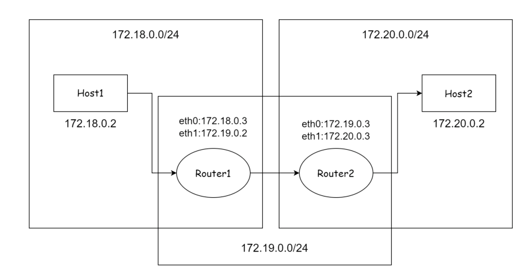
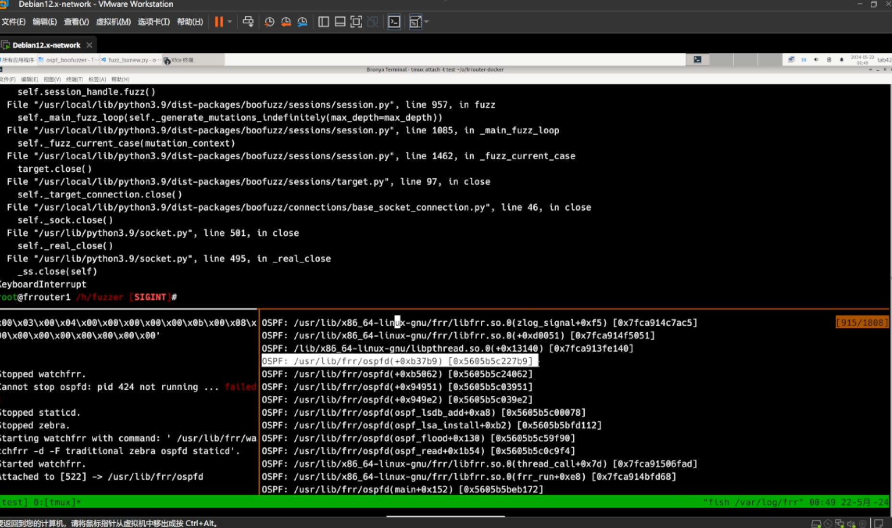
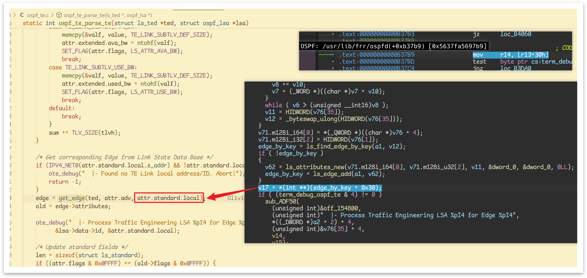

## Introduction

参考 [Forescout/bgp_boofuzzer](https://github.com/Forescout/bgp_boofuzzer/tree/master) 的结构特化了一个 OSPF 版本

## Installation

docker 配置文件放置在`frrouter-docker`中，使用`docker-compose up -d`即可启动容器，docker 配置的路由环境如下



fuzzer 运行在 frrouter1 上，对 frrouter2 发送 fuzzing 包

```bash
# frrouter2
docker exec -it frrouter2 fish
cd /home/fuzzer

python3 main.py --ip [rpc ip] --port [rpc port] --monitor frr
```

等待 frr 服务重启后，watchfrr 和 boofuzz 的 procmon 会监控 ospfd 的存活情况，此时可以进行 fuzz 了

```bash
# frrouter1
docker exec -it frrouter1 fish
cd /home/fuzzer

python3 fuzz_xxx.py --route_id [router ip] --area_id 0.0.0.0 --tip [rpc ip] --trpc_port [rpc port]
```

## Details

### 报文协议树可视生成

frr-router 的 docker 环境中安装了graphviz，可以在每个报文的`do_fuzz`方法中加入以下代码，生成每个报文的状态图

```python
with open('somefile.png', 'wb') as file:
    file.write(session.render_graph_graphviz().create_png())
```

### 目标修改

在 fuzzer.py 中，可能需要修改这一部分来满足报文能发送到目标服务器上并被识别

```python
self.session_handle = Session(
    target=Target(
        # You need to change l2_dst MAC address and interface name.
        connection=RawL3SocketConnection(
            interface="eth0",
            send_timeout=5,
            recv_timeout=5,
            l2_dst=b'\x01\x00\x5e\x00\x00\x05'
        ),
    ),
```

其中`interface`和`l2_dst`需要根据实际情况修改

### 路径修改

docker 配置的 volumns 映射是绝对路径，需要根据实际情况修改

```yaml
        frrouter1:
                build:
                        context: ./build
                        dockerfile: Dockerfile-frrouter
                container_name: frrouter1
                hostname: frrouter1
                networks:
                        net1:
                                ipv4_address: 172.18.0.3
                        net2:
                                ipv4_address: 172.19.0.2
                volumes:
                        - ./files/orchestrator.sh:/usr/src/files/orchestrator.sh
                        - ./configs/frrouter1/.env:/usr/src/config/.env
                        - ./configs/frrouter1/frr/:/etc/frr
                        - /home/ospf_boofuzzer/:/home/fuzzer
                cap_add:
                        - NET_ADMIN
                        - NET_BIND_SERVICE
                        - NET_RAW
                        - SYS_ADMIN
                command: 'sh -c "/usr/src/files/orchestrator.sh"'
                privileged: true
                ports:
                        - "26000:12345"

        frrouter2:
                build:
                        context: ./build
                        dockerfile: Dockerfile-frrouter
                container_name: frrouter2
                hostname: frrouter2
                networks:
                        net2:
                                ipv4_address: 172.19.0.3
                        net3:
                                ipv4_address: 172.20.0.3
                volumes:
                        - ./files/orchestrator.sh:/usr/src/files/orchestrator.sh
                        - ./configs/frrouter2/.env:/usr/src/config/.env
                        - ./configs/frrouter2/frr/:/etc/frr
                        - /home/ospf_boofuzzer/:/home/fuzzer
                cap_add:
                        - NET_ADMIN
                        - NET_BIND_SERVICE
                        - NET_RAW
                        - SYS_ADMIN
                command: 'sh -c "/usr/src/files/orchestrator.sh"'
                privileged: true
```

## Result

测试复现[CVE-2024-27913](https://www.cvedetails.com/cve/CVE-2024-27913/)漏洞，结果如下





